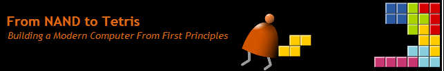
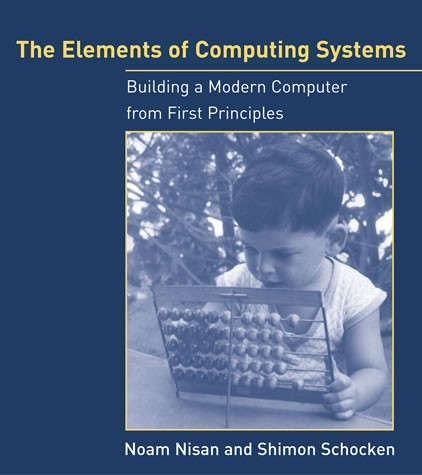

# nand-2-tetris

My solutions to the popular Nand 2 Tetris course (part I and II) on Coursera.

	

## Coursera links

- [From Nand to Tetris Part I](https://www.coursera.org/learn/build-a-computer)
- [From Nand to Tetris Part II](https://www.coursera.org/learn/nand2tetris2)

This course is based on the 'The Elements of Computing Systems: Building a Modern Computer from First Principles', 
by Noam Nisan, Shimon Schocken.

	

## Where to find the book

- [From Nand to Tetris site](https://www.nand2tetris.org/)
- [Purchase on Amazon](https://www.amazon.com/Elements-Computing-Systems-Building-Principles/dp/0262640686/ref=ed_oe_p)
- [MIT Press](https://mitpress.mit.edu/books/elements-computing-systems)

